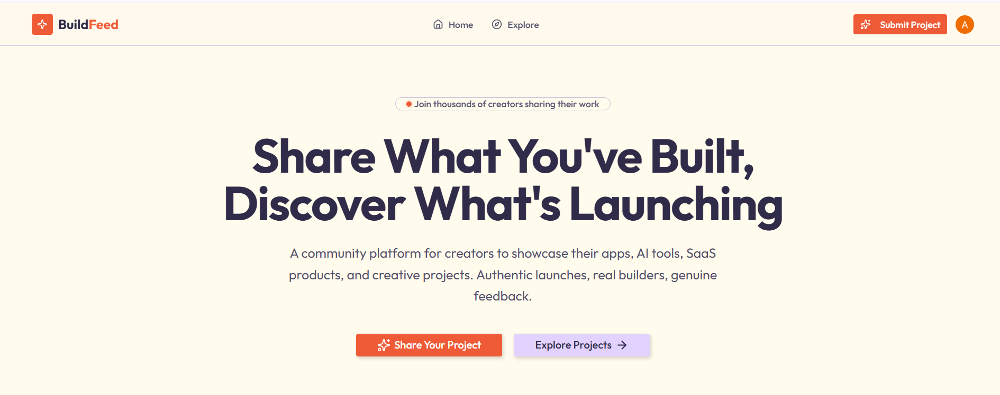
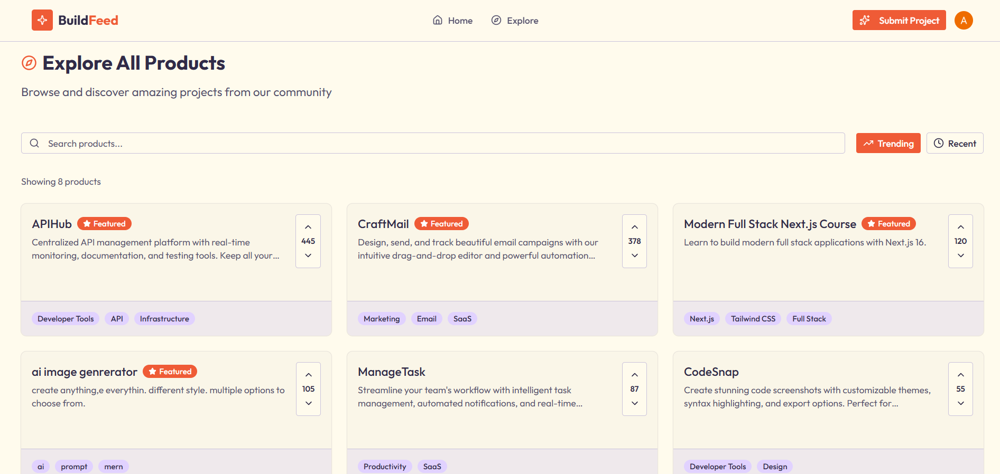
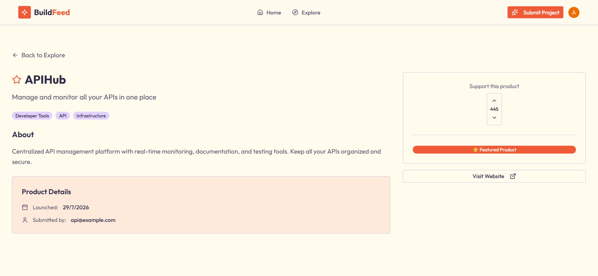
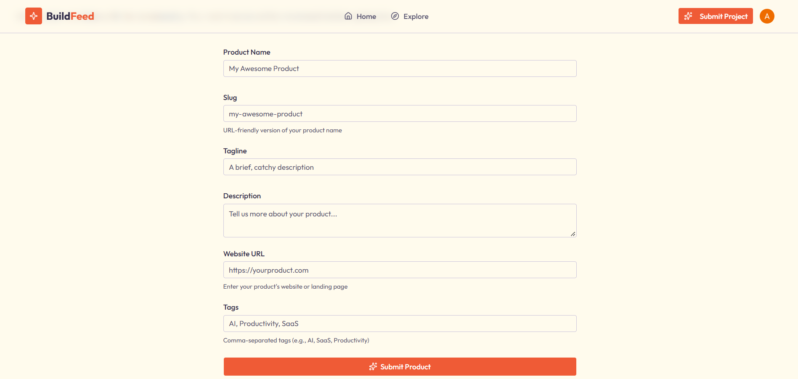
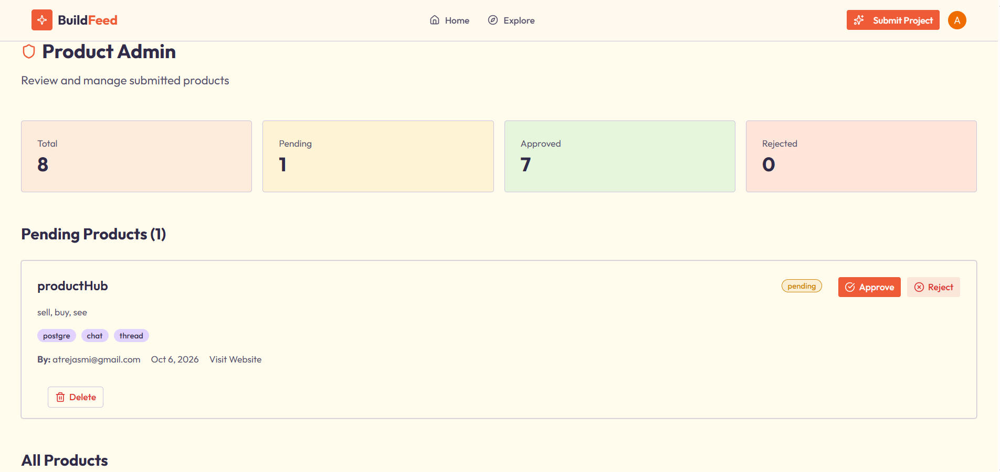

# 🚀 BuildFeed

A community-driven launch platform where makers, developers, and startups can showcase what they've built and get discovered by an audience that genuinely cares about new products.

Makers can submit their apps, AI tools, SaaS products, and side projects, while the community upvotes or downvotes them in real time. The most loved products rise to the **Featured Today** spotlight on the home page, and everything else stays easy to explore in a searchable directory. Every submission goes through an admin review before going live, keeping the feed authentic, high-quality, and spam-free.



## ✨ Features

- 🌟 **Featured Today** – top products (100+ votes) on the home page
- 👍 **Voting** – upvote / downvote with optimistic UI (sign-in required)
- 🔍 **Explore** – browse all approved products
- 📝 **Submit a product** – signed-in organization members can submit products
- 🛡️ **Admin panel** – approve or reject pending products
- 🔐 **Auth** – Clerk (sign in, sign up, organizations)

## 📸 Screenshots

| Explore | Product Details |
| :---: | :---: |
|  |  |

| Submit Product | Admin Panel |
| :---: | :---: |
|  |  |

## 🛠️ Tech Stack

- **Next.js 16 (App Router)** – Full-stack framework with Cache Components and Server Actions
- **React 19** – Component-based user interface
- **TypeScript** – Type-safe development across the project
- **Tailwind CSS 4** – Utility-first styling
- **shadcn/ui** – Accessible, reusable UI components
- **Clerk** – Authentication, organizations, and admin roles
- **Neon (PostgreSQL)** – Serverless cloud database
- **Drizzle ORM** – Type-safe queries, schema, and migrations
- **Zod** – Validation for forms and server actions
- **Lucide React** – Icon set

## ⚙️ Getting Started

```bash
# 1. Install dependencies
npm install

# 2. Add environment variables (see below) in .env

# 3. Push the schema to the database
npx drizzle-kit push

# 4. Run the dev server
npm run dev
```

Open [http://localhost:3000](http://localhost:3000).

### 🔑 Environment Variables

Create a `.env` file in the root:

```env
DATABASE_URL=your_neon_postgres_url
NEXT_PUBLIC_CLERK_PUBLISHABLE_KEY=your_clerk_publishable_key
CLERK_SECRET_KEY=your_clerk_secret_key
```

### 👑 Making a user admin

In the Clerk dashboard, open the user → **Public metadata** and add:

```json
{ "isAdmin": true }
```
